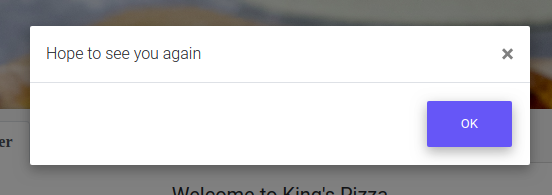
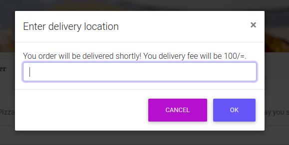
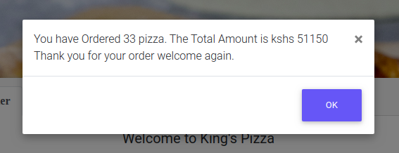

# PROJECT TITLE: Kings's Pizza 
>Kings pizza is a website with a menu and a way to order pizza .
# PROJECT AUTHOR: Muthoni Stephen Ngugi
### Gettng Started
>>To get started you simply have to download a copy of the project from the repo.
## Prerequisites
>>No special Prerequisites are required to run this project.
## Installing
>>Simply double click on the index file and it will open in your browser.
## Running the tests
>>no tests are required
## Built With:
[HTML5](https://en.wikipedia.org/wiki/HTML5): html is a mark up language

[CSS3](https://en.wikipedia.org/wiki/Cascading_Style_Sheets): was used to do some of the styling of the page

[Bootstrap-4](https://getbootstrap.com/): Most of the styling

[javascript](https://en.wikipedia.org/wiki/JavaScript): used on the order form

## BDD
>user opens the site and finds a short story about King's Pizza on the landing page.
>>>  
>user can then navigate to the menu where they can see the prices of different sizes of pizza and how the prices change according to what accompanies the pizza(either a soda or toppings)  
>>> 
>user can then navigate to the order page where they may place their order
>>> 
>>after getting to the order page if the user checksout without placing an order they get an alert saying "hope to see you again"
>>>> 
>>if the user places an order the first get a prompt asking for their location and informing them of delivery price:
>>>> 
>>>after this they get a prompt informing them of the price for their purchase:
>>>> 
